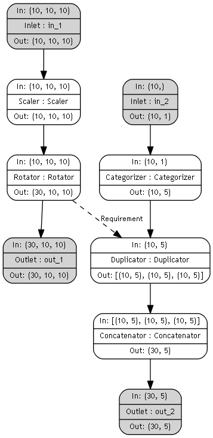

# Lyteflow
Pipeline system for sequential data transformations
## Description
Lyteflow is to ensure consistent, simple, and sequential data transformations. A System
 of pipe elements can be created, and placed in a pipe system. The flow starts from 
 Inlets, flows through the individual pipe elements, and ends in an Outlet. The flow 
 from individual pipe elements are universally compatible. The pipe elements will 
 attempt to pass a Numpy array or a pandas DataFrame to each other (depending on the 
 context).
## Installation
```bash
git clone https://github.com/MammothStack/Lyteflow.git Lyteflow
```
## Usages
Concurrent data pipelines can be created with dependencies between each transformation.
Here the images are rotated n times (this can be ambiguous as rotations such as 10 and 370 degrees are the same thing)
and so the labels also need to be duplicated n number of times. This dependecy is created through the Requirement
class:

```python
from lyteflow.construct import PipeSystem
from lyteflow.kernels import *

in_1 = Inlet(convert=False, name="in_1")
sca = Scaler(scalar=1 / 255)(in_1)
rot = Rotator([90, -90], remove_padding=False, keep_original=True)(sca)
out_1 = Outlet(name="out_1")(rot)

in_2 = Inlet(convert=True, name="in_2")
cat = Categorizer(sparse=True)(in_2)
dup = Duplicator()(cat)
con = Concatenator()(dup)
out_2 = Outlet(name="out_2")(con)

dup.add_requirement(Requirement(rot, attribute="n_rotations", argument="n_result"))

ps = PipeSystem(inlets=[in_1, in_2], outlets=[out_1, out_2], name="ps", verbose=True)

processed_images, processed_labels = ps.flow(images, labels)
```

The resulting PipeSystem will look as follows:



In order to create visualizations just import the plot_pipe_system method from the _visualize_ module
```python
from lyteflow.visualize import plot_pipe_system
from lyteflow.sample import ps_complex_req

plot_pipe_system(ps_complex_req, file_name="pipe_system.png")
```
## Authors
Patrick Bogner
## License
[MIT](https://choosealicense.com/licenses/mit/)
## Status
Development ongoing
